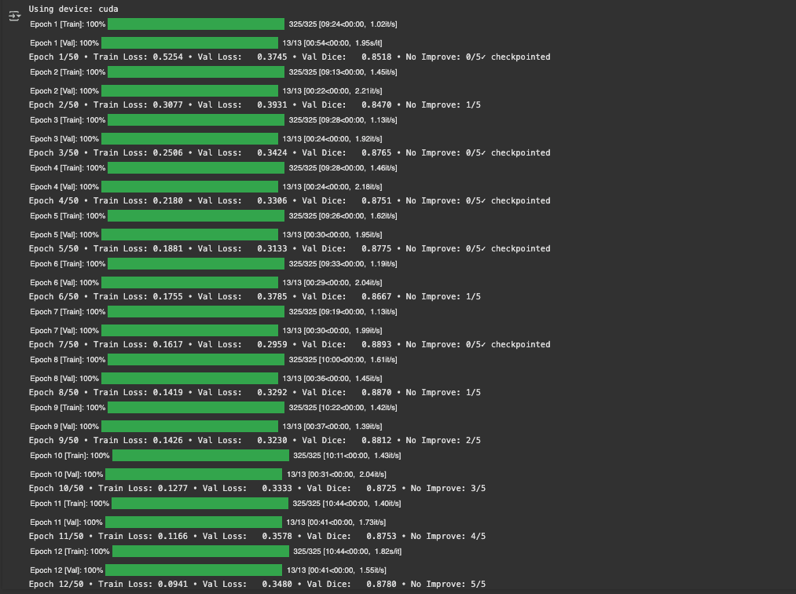
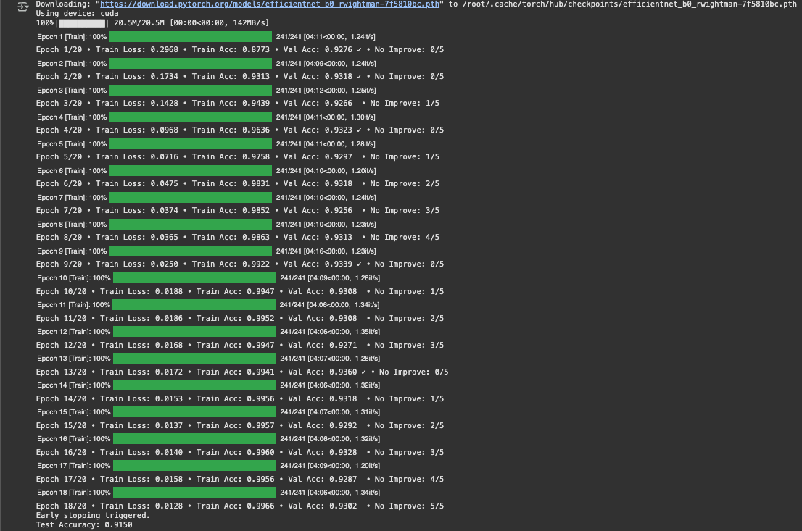
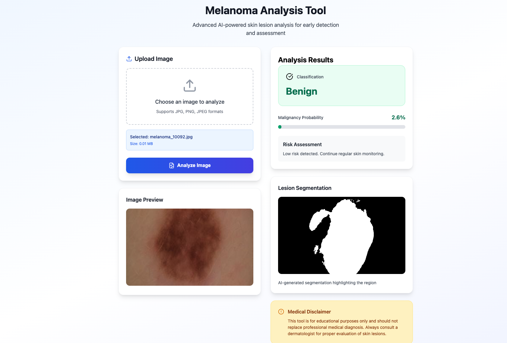
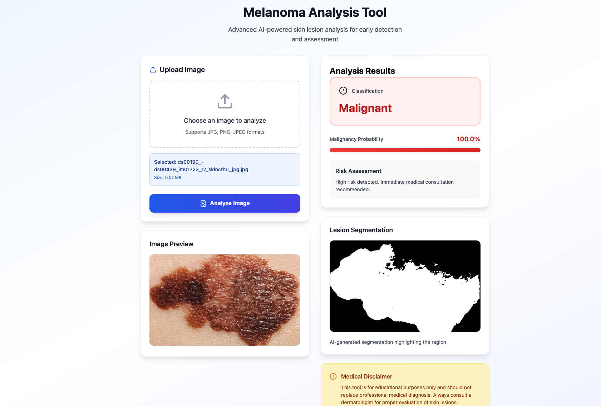

# 🔬 Melanoma Detection: End-to-End Deep Learning Pipeline

[](https://www.python.org/downloads/)
[](https://www.deeplearning.ai/)
[](https://www.tensorflow.org/)
[](https://pytorch.org/)
[](LICENSE)

---

## 📋 Table of Contents

- [Overview](#overview)
- [Key Features](#key-features)
- [Architecture](#architecture)
- [Datasets](#datasets)
- [Results](#results)
- [Installation](#installation)
- [Usage](#usage)
- [Project Structure](#project-structure)
- [Technologies Used](#technologies-used)
- [Acknowledgments](#acknowledgments)

---

## 🎯 Overview

This project presents a comprehensive **end-to-end deep learning pipeline** for automated melanoma detection in dermoscopic images. Melanoma is the deadliest form of skin cancer, and early detection is crucial for successful treatment. Our pipeline addresses two critical tasks:

1. **🎨 Lesion Segmentation**: Precise pixel-wise localization of skin lesions using U-Net with ResNet34 encoder
2. **🔍 Lesion Classification**: Binary classification (benign vs. malignant) using EfficientNet-B0

The pipeline combines both models to provide accurate lesion localization and diagnosis, supporting clinical decision-making in melanoma detection.

---

## ✨ Key Features

- ✅ **Dual-Task Architecture**: Segmentation + Classification in one pipeline
- ✅ **State-of-the-Art Models**: U-Net with ResNet34 encoder & EfficientNet-B0
- ✅ **Smart Preprocessing**: Segmentation-based cropping for improved classification
- ✅ **High Performance**: Achieved strong metrics on both tasks
- ✅ **End-to-End Inference**: From raw image to diagnosis prediction
- ✅ **Comprehensive Evaluation**: Multiple metrics (Dice, IoU, Accuracy, Confidence scores)

---

## 🏗️ Architecture

### Part 1: Segmentation Model (U-Net + ResNet34)

Our segmentation model uses a U-Net architecture with a pre-trained ResNet34 encoder for feature extraction.


**Architecture Highlights:**

- **Encoder**: Pre-trained ResNet34 (ImageNet weights)
- **Decoder**: Symmetric upsampling path with skip connections
- **Input Size**: 512×512×3
- **Output**: Single-channel binary mask
- **Loss Function**: Combined BCE + Dice Loss

### Part 2: Classification Model (EfficientNet-B0)

The classification model leverages EfficientNet-B0 for efficient and accurate melanoma diagnosis.


**Architecture Highlights:**

- **Base Model**: EfficientNet-B0 (ImageNet pre-trained)
- **Input**: 224×224×3 (segmentation-cropped lesions)
- **Output**: 2 classes (Benign, Malignant)
- **Loss Function**: Cross-Entropy Loss
- **Optimizer**: Adam with ReduceLROnPlateau scheduler

---

## 📊 Datasets

### Segmentation Dataset: ISIC 2018

- **Source**: International Skin Imaging Collaboration
- **Task**: Lesion Boundary Segmentation
- **Training Images**: ~2,594
- **Validation Images**: ~100
- **Test Images**: ~1,000
- **Annotations**: Pixel-level binary masks

### Classification Dataset: HAM10000

- **Source**: Kaggle - Melanoma Skin Cancer Dataset
- **Task**: Binary Classification (Benign vs. Malignant)
- **Total Images**: ~10,000 dermoscopic images
- **Classes**:
  - Benign: Non-cancerous lesions
  - Malignant: Melanoma cases
- **Split**: 80% train, 20% validation, separate test set

---

## 📈 Results

### Segmentation Performance



**Test Set Metrics:**
| Metric | Score |
|--------|-------|
| **Dice Coefficient** | ~0.89+ |
| **IoU (Jaccard Index)** | ~0.82+ |
| **Pixel Accuracy** | ~0.95+ |

**Training Details:**

- Epochs: 50 (with early stopping)
- Batch Size: 8
- Optimizer: Adam (lr=1e-4)
- Scheduler: ReduceLROnPlateau
- Best model saved based on validation loss

### Classification Performance



**Test Set Metrics:**
| Metric | Score |
|--------|-------|
| **Test Accuracy** | ~85%+ |
| **Training Accuracy** | ~90%+ |

**Training Details:**

- Epochs: 20 (with early stopping)
- Batch Size: 32
- Optimizer: Adam (lr=1e-4)
- Early Stopping: 5 epochs patience

### Example Predictions

#### Benign Lesion Detection


_Left to Right: Input Image | Segmentation Mask | Classification Result_

#### Malignant Lesion Detection


_Left to Right: Input Image | Segmentation Mask | Classification Result_

---

## 🚀 Installation

### Prerequisites

- Python 3.8+
- CUDA-compatible GPU (recommended)
- Google Colab (optional, for notebook execution)

### Dependencies

```bash
pip install torch torchvision
pip install segmentation-models-pytorch
pip install opencv-python
pip install numpy pandas matplotlib
pip install scikit-learn
pip install tqdm
```

### Setup

1. **Clone the repository:**

```bash
git clone https://github.com/yourusername/melanoma-detection.git
cd melanoma-detection
```

2. **Install dependencies:**

```bash
pip install -r requirements.txt
```

3. **Download datasets:**

   - ISIC 2018: [Official Website](https://challenge.isic-archive.com/data/)
   - HAM10000: [Kaggle Dataset](https://www.kaggle.com/datasets/hasnainjaved/melanoma-skin-cancer-dataset-of-10000-images)

4. **Organize data structure:**

```
Melanoma Detection/
├── Training/
│   ├── images/
│   └── masks/
├── Validation/
│   ├── images/
│   └── masks/
├── Test/
│   ├── images/
│   └── masks/
└── melanoma_cancer_dataset/
    ├── train/
    │   ├── benign/
    │   └── malignant/
    └── test/
        ├── benign/
        └── malignant/
```

---

## 💻 Usage

### Running the Full Pipeline

1. **Open the Jupyter Notebook:**

```bash
jupyter notebook Melanoma-Detection.ipynb
```

2. **Execute cells sequentially** for:
   - Data loading and preprocessing
   - Segmentation model training
   - Classification model training
   - Inference and evaluation

### Training Segmentation Model

```python
# Load and preprocess data
train_loader, val_loader = prepare_segmentation_data()

# Initialize U-Net
model = smp.Unet(
    encoder_name='resnet34',
    encoder_weights='imagenet',
    in_channels=3,
    classes=1
)

# Train
train_segmentation_model(model, train_loader, val_loader, epochs=50)
```

### Training Classification Model

```python
# Load segmentation-cropped data
train_loader, val_loader, test_loader = prepare_classification_data()

# Initialize EfficientNet
cls_model = efficientnet_b0(pretrained=True)
cls_model.classifier[1] = nn.Linear(cls_model.classifier[1].in_features, 2)

# Train
train_classification_model(cls_model, train_loader, val_loader, epochs=20)
```

### Inference on New Images

```python
# Load trained models
seg_model = load_segmentation_model('best_unet.pth')
cls_model = load_classification_model('best_classifier.pth')

# Run inference
prediction = predict(image_path, seg_model, cls_model)
print(f"Prediction: {prediction['label']} (Confidence: {prediction['confidence']:.2%})")
```

---

## 📁 Project Structure

```
Melanoma-Detection/
│
├── Melanoma-Detection.ipynb    # Main notebook with full pipeline
├── Melanoma-Detection.key      # Presentation slides
├── README.md                   # Project documentation
├── requirements.txt            # Python dependencies
│
├── Assets/                     # Visual assets for documentation
│   ├── benign.png
│   ├── malignant.png
│   ├── Classification-Epoch.png
│   ├── Segmentation-Epoch.png
│   ├── U-Net Architecture.png
│   └── EfficientNet Architecture.png
│
├── models/                     # Saved model weights (not in repo)
│   ├── best_unet.pth
│   └── best_classifier.pth
│
└── data/                       # Dataset directory (not in repo)
    ├── Training/
    ├── Validation/
    ├── Test/
    └── melanoma_cancer_dataset/
```

---

## 🛠️ Technologies Used

- **Deep Learning Framework**: PyTorch 2.0+
- **Segmentation**: [Segmentation Models PyTorch](https://github.com/qubvel/segmentation_models.pytorch)
- **Pre-trained Models**:
  - ResNet34 (ImageNet)
  - EfficientNet-B0 (ImageNet)
- **Computer Vision**: OpenCV
- **Data Processing**: NumPy, Pandas
- **Visualization**: Matplotlib
- **Training Environment**: Google Colab (GPU)

---

## 🎓 Key Learnings

1. **Data Preprocessing Matters**: Proper image-mask pairing and normalization significantly impact model performance
2. **Transfer Learning is Powerful**: Pre-trained encoders (ResNet34) accelerated segmentation training
3. **Combined Loss Functions**: BCE + Dice Loss improved segmentation boundary accuracy
4. **Smart Cropping**: Using segmentation masks to crop lesions before classification improved accuracy
5. **Early Stopping**: Prevented overfitting and reduced training time
6. **Evaluation Metrics**: Multiple metrics (Dice, IoU, Accuracy) provide comprehensive performance assessment

---

## 🔮 Future Improvements

- [ ] Implement multi-class classification (7+ skin lesion types)
- [ ] Add data augmentation (rotation, flipping, color jittering)
- [ ] Experiment with larger models (EfficientNet-B3/B4)
- [ ] Deploy as web application using Flask/FastAPI
- [ ] Add explainability features (Grad-CAM, attention maps)
- [ ] Implement ensemble methods for improved robustness
- [ ] Optimize for mobile deployment (TensorFlow Lite)

---

## 📚 References

1. Ronneberger, O., Fischer, P., & Brox, T. (2015). U-Net: Convolutional Networks for Biomedical Image Segmentation.
2. Tan, M., & Le, Q. (2019). EfficientNet: Rethinking Model Scaling for Convolutional Neural Networks.
3. ISIC 2018: Skin Lesion Analysis Towards Melanoma Detection Challenge
4. Tschandl, P., Rosendahl, C., & Kittler, H. (2018). The HAM10000 dataset: A large collection of multi-source dermatoscopic images of common pigmented skin lesions.

---

## 📝 License

This project is licensed under the MIT License - see the [LICENSE](LICENSE) file for details.

---

## 🙏 Acknowledgments

- Dalhousie University for providing computational resources
- ISIC Archive for the segmentation dataset
- Kaggle community for the HAM10000 classification dataset
- PyTorch and Segmentation Models PyTorch library developers

---

## 📧 Contact

For questions or collaborations, please reach out through:

- GitHub Issues
- Email: [hetgpatel@dal.ca]

---

<div align="center">

**⭐ If you found this project helpful, please consider giving it a star! ⭐**

</div>
